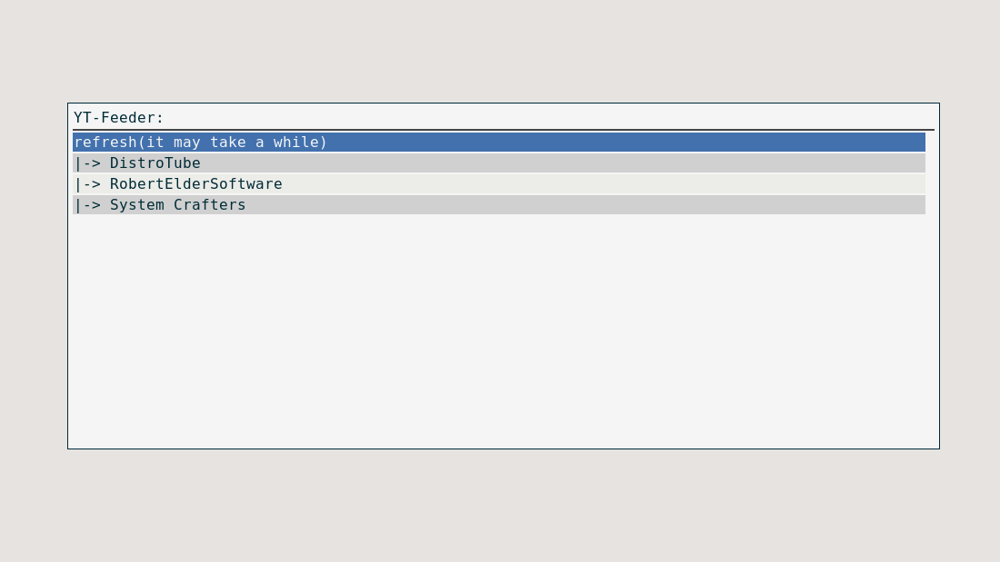
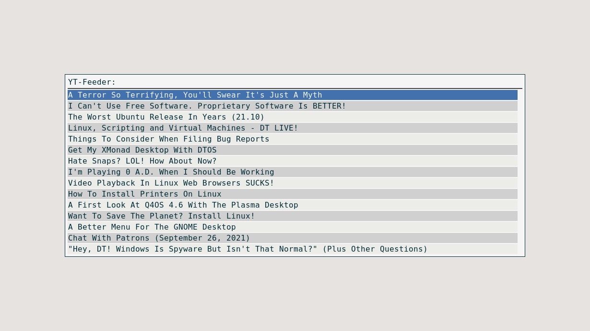
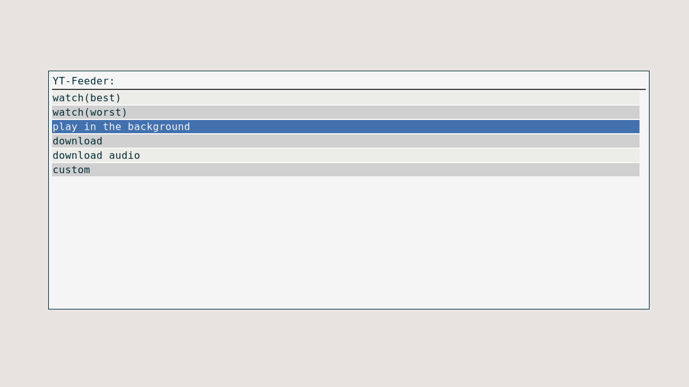

- [IMPORTANT](#orgd3403d0)
- [Introduction](#org08e2cbb)
- [Usage](#org12375b8)
  - [Worth noting](#orgc39f9bf)
- [Configuration](#org4be44c6)
- [Requirements](#org3673e99)
- [TODO](#org7f53b83)
- [Gallery](#org2c30b96)


<a id="orgd3403d0"></a>

# IMPORTANT

**There was an important change to the config file syntax, check it before filling an issue. It was required to make sure some edge cases works and it makes it easier to manage configuration file. There probably won&rsquo;t be another syntax change, this one can be considered final**


<a id="org08e2cbb"></a>

# Introduction

YT-Feeder is a Rofi-Based RSS Reader made specifically for YouTube video platform. It&rsquo;s written purely in bash and allows user to watch or download new videos.


<a id="org12375b8"></a>

# Usage

While in the project folder:

```bash
chmod +x YT-Feeder
```

Then to actually run the script:

```bash
rofi -show YT-Feeder -modi "YT-Feeder:Absolute/Path/To/YT-Feeder"
```

I highly suggest binding the above command to your keyboard shortcut of choice. After launch you can select your favorite channel from the list, then select video and then you have a choice to:

-   watch(best) -> watch it in the best quality
-   watch(worst) -> watch it in the worst quality
-   play in the background -> play audio from video in the background
-   download -> download video
-   download audio -> download audio from video
-   command -> use your custom command on video&rsquo;s link

There&rsquo;s also an option to refresh the RSS feeds at the top of the list and there might be an option to stop currently playing audio in the background(only after selecting &ldquo;play in the background&rdquo;).


<a id="orgc39f9bf"></a>

## Worth noting

The default directory for downloaded videos is ~/Videos/ and the default directory for downloaded audio is ~/Music/.


<a id="org4be44c6"></a>

# Configuration

Change ~/.config/yt-feeder/config file to configure this script. If it doesn&rsquo;t exist, create it. The general syntax for this file is:

```
// Some comment
rss link or channel's ID
rss link or channel's ID
rss link or channel's ID
DOWNLOAD|~/Videos/folder_for_yt_videos
COMMAND|my_custom_command
DOWNLOAD_AUDIO|~/Music/folder_for_yt_audio
```

Comments must be placed on separate lines, every line starting with &ldquo;//&rdquo; will be ignored by the script

-   `DOWNLOAD` specifies the custom directory where you wish to download your videos.
-   `COMMAND` specifies your custom command to use on youtube links.
-   `DOWNLOAD_AUDIO` specifies the custom directory where you wish to download your audio.


<a id="org3673e99"></a>

# Requirements

Currently only requirements are:

-   mpv
-   youtube-dl
-   rofi


<a id="org7f53b83"></a>

# TODO

-   [X] Add information about the number of new videos
-   [X] Auto-detect Channel&rsquo;s name from RSS Feed
-   [X] Clean bash code
-   [X] Add option to change the default directory of downloaded videos
-   [X] Add option to play video in the background
-   [X] Add an ability to just use channel&rsquo;s ID in the config file
-   [X] Add option to use a custom script on selected video


<a id="org2c30b96"></a>

# Gallery

**[YT-Feeder Example Video](https://youtu.be/V2Oi5kPDTj4 )**

  
